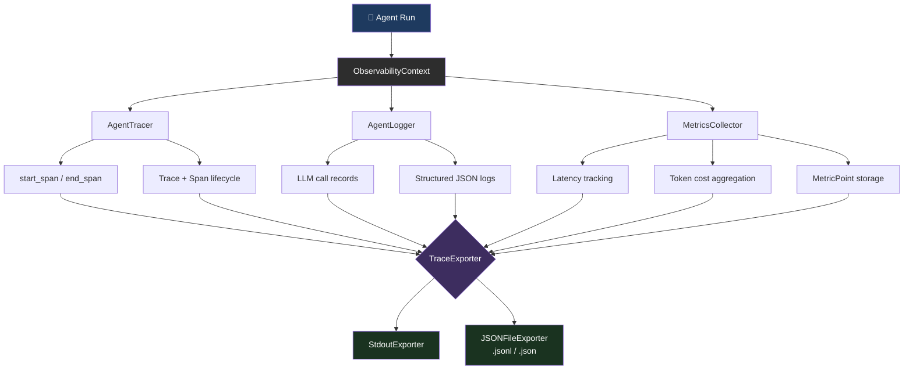
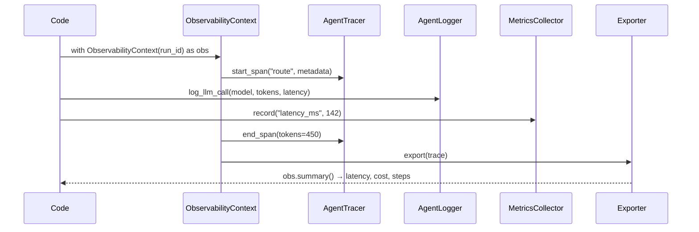

# agent-observability

> **Structured logging, tracing, and metrics for LLM agent systems.**

[](https://www.python.org/)
[](LICENSE)
[](#)

`agent-observability` is the **operational visibility layer** for production LLM agent systems.  
It gives you deep insight into every agent run — spans, latency, token usage, cost, and success rates — with **zero external dependencies**.

---


## How It Works





---

## Features

| Component | What it does |
|---|---|
| `AgentTracer` | Trace multi-step agent runs with nested spans (start/end/duration/tokens) |
| `AgentLogger` | Structured JSON logging for LLM calls (model, prompt hash, latency, cost) |
| `MetricsCollector` | Collect & aggregate metrics (success rate, avg latency, p95/p99, token usage) |
| `TraceExporter` | Export traces to JSON file / stdout — extensible for OTEL |
| `ObservabilityContext` | Single context manager that wires all the above together |

---

## Installation

```bash
pip install agent-observability
```

**Zero external dependencies** — pure Python stdlib.

---

## Quick Start

```python
from agent_observability import ObservabilityContext

ctx = ObservabilityContext("my-agent")

with ctx.trace("run-1") as trace:
    with ctx.span("llm-call") as span:
        # Simulate an LLM call
        ctx.log_call(
            model="gpt-4o",
            prompt="Summarize the following document...",
            latency_ms=312.5,
            tokens_in=1024,
            tokens_out=256,
            cost_usd=0.003,
            span=span,
            trace=trace,
        )

    with ctx.span("tool-use") as span:
        ctx.log_call(
            model="gpt-4o",
            prompt="Search the web for X",
            latency_ms=150.0,
            tokens_in=50,
            tokens_out=20,
            span=span,
        )

ctx.export_all()
print(ctx.summary())
```

Output:
```json
{
  "name": "my-agent",
  "trace_count": 1,
  "call_count": 2,
  "success_rate": 1.0,
  "total_cost_usd": 0.003,
  "metrics": { ... }
}
```

---

## Components

### AgentTracer

```python
from agent_observability import AgentTracer

tracer = AgentTracer()

with tracer.start_trace("agent-run") as trace:
    with tracer.start_span("llm-call") as span:
        span.finish(tokens_in=100, tokens_out=50)

print(trace.total_tokens_in)   # 100
print(trace.duration_ms)       # e.g. 5.3
```

### AgentLogger

```python
from agent_observability import AgentLogger

logger = AgentLogger("my-agent")
logger.log_call(
    model="claude-3-sonnet",
    prompt="Hello world",       # stored as SHA-256 hash
    latency_ms=200.0,
    tokens_in=10,
    tokens_out=80,
    cost_usd=0.001,
)

print(logger.success_rate())  # 1.0
print(logger.total_cost())    # 0.001
```

### MetricsCollector

```python
from agent_observability import MetricsCollector

mc = MetricsCollector()
mc.record("latency_ms", 120.5, labels={"model": "gpt-4o"})
mc.record("latency_ms", 85.3)
mc.record_success()
mc.record_error()

agg = mc.aggregate("latency_ms")
print(agg.mean, agg.p95, agg.p99)
print(mc.success_rate())   # 0.5
```

### TraceExporter

```python
from agent_observability import TraceExporter, JSONFileExporter, StdoutExporter

exporter = TraceExporter([
    StdoutExporter(),
    JSONFileExporter("/var/log/agent/traces.jsonl"),
])
exporter.export(tracer.traces)
```

---

## Architecture

```
ObservabilityContext
├── AgentTracer        → Trace / Span lifecycle
├── AgentLogger        → Structured JSON LLM call records
├── MetricsCollector   → Numeric metric aggregation
└── TraceExporter
    ├── StdoutExporter
    └── JSONFileExporter   (JSONL or JSON array)
```

---

## Running Tests

```bash
pip install -e ".[dev]"
pytest tests/ -v
```

All 40+ tests pass. Zero external dependencies.

---

## Extending

### Custom Exporter (e.g. OpenTelemetry)

```python
from agent_observability.exporter import BaseExporter
from agent_observability.tracer import Trace
from typing import List

class OTELExporter(BaseExporter):
    def export(self, traces: List[Trace]) -> None:
        for trace in traces:
            self.export_one(trace)

    def export_one(self, trace: Trace) -> None:
        # Push to OTEL collector
        payload = trace.to_dict()
        # requests.post("http://otel-collector:4318/v1/traces", json=payload)
        ...
```

---

## Contributing

See [CONTRIBUTING.md](CONTRIBUTING.md).

## Security

See [SECURITY.md](SECURITY.md).

## Code of Conduct

See [CODE_OF_CONDUCT.md](CODE_OF_CONDUCT.md).

## License

MIT — see [LICENSE](LICENSE).
