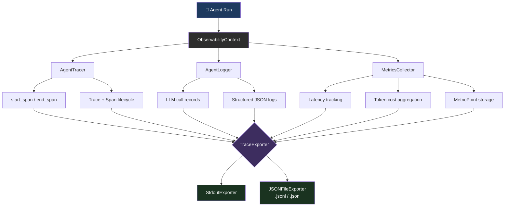
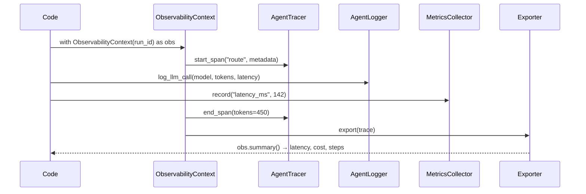

# agent-observability

**Production-grade LLM agent observability.** Structured span tracing, cost tracking per run, and flexible log export — zero external dependencies.

[](https://www.python.org/downloads/)
[](LICENSE)
[]()

---


## How It Works





---

## Features

| Component | What it does |
|-----------|-------------|
| `ObservabilityMiddleware` | Wraps any agent run — captures timing, tokens, cost, steps, success/failure |
| `SpanTracer` | Creates nested spans for tool calls (hierarchical, auto-parented) |
| `CostTracker` | Per-model cost computation with built-in pricing for GPT-4o, Claude, Gemini |
| `LogExporter` | Export to JSONL file, stdout (pretty), or Python dict |

**Zero dependencies** — stdlib only (`time`, `uuid`, `json`, `pathlib`, `contextlib`). Works on Python 3.10+.

---

## Installation

```bash
pip install agent-observability
```

Or from source:

```bash
git clone https://github.com/darshjme/agent-observability
cd agent-observability
pip install -e .
```

---

## Quick Start

```python
from agent_observability import ObservabilityMiddleware, LogExporter

# 1. Create middleware for your model
mw = ObservabilityMiddleware(model_id="gpt-4o")

# 2. Trace a run
with mw.trace_run() as run:
    # Your agent logic here
    response = call_llm(prompt)
    run.record_tokens(tokens_in=512, tokens_out=128)
    run.add_step()

# 3. Inspect results
r = mw.runs[-1]
print(f"Cost: ${r.cost_usd:.6f}")   # Cost: $0.004480
print(f"Duration: {r.duration_ms:.1f}ms")
print(f"Success: {r.success}")

# 4. Export to JSONL
exporter = LogExporter()
exporter.export_to_jsonl(mw.runs, path="runs.jsonl")
```

---

## Components

### ObservabilityMiddleware

Wraps agent runs with full lifecycle tracing.

```python
from agent_observability import ObservabilityMiddleware

mw = ObservabilityMiddleware(
    model_id="claude-sonnet",
    on_run_complete=lambda ctx: print(f"Run done: ${ctx.cost_usd:.6f}"),
)

# Context manager (recommended)
with mw.trace_run(metadata={"user_id": "u123"}) as run:
    run.record_tokens(tokens_in=1000, tokens_out=500)
    run.add_step()
    run.set_metadata("task", "summarization")
    # If an exception is raised, run.success=False is set automatically

# Function wrapper
def my_agent():
    return "done"

traced_agent = mw.wrap(my_agent)
result = traced_agent()

# Aggregate stats
print(mw.stats())
# {
#   "total_runs": 2,
#   "successful_runs": 2,
#   "failed_runs": 0,
#   "total_tokens_in": 1000,
#   "total_tokens_out": 500,
#   "total_cost_usd": 0.01050,
#   "total_steps": 1,
#   "avg_duration_ms": 3.2
# }
```

**RunContext fields:**

| Field | Type | Description |
|-------|------|-------------|
| `run_id` | str | UUID4 unique run identifier |
| `model_id` | str | Model used |
| `start_time` | float | Unix timestamp |
| `end_time` | float | Unix timestamp (set on exit) |
| `duration_ms` | float | Wall-clock duration |
| `tokens_in` | int | Accumulated input tokens |
| `tokens_out` | int | Accumulated output tokens |
| `cost_usd` | float | Computed cost in USD |
| `steps` | int | Number of agent steps |
| `success` | bool | True unless exception raised |
| `error_msg` | str? | Exception message on failure |
| `metadata` | dict | Custom key-value pairs |
| `tracer` | SpanTracer | Nested span tree |

---

### SpanTracer

Track nested tool calls within a run.

```python
with mw.trace_run() as run:
    # Auto-parenting: child spans attach to the current stack top
    root_id = run.tracer.start_span("agent_run")
    
    tool_id = run.tracer.start_span("web_search", metadata={"query": "python async"})
    # ... execute tool ...
    run.tracer.end_span(tool_id, metadata={"results": 5})
    
    embed_id = run.tracer.start_span("embed_results")
    run.tracer.end_span(embed_id)
    
    run.tracer.end_span(root_id)

# Inspect tree
spans = run.tracer.to_dict()
# [{"name": "agent_run", "children": [
#     {"name": "web_search", "duration_ms": 342.1, ...},
#     {"name": "embed_results", "duration_ms": 12.4, ...}
# ], ...}]
```

---

### CostTracker

Compute and accumulate LLM costs.

```python
from agent_observability import CostTracker, ModelPricing

tracker = CostTracker()

# Built-in models
cost = tracker.compute_cost("gpt-4o", tokens_in=1000, tokens_out=500)
# = (1000/1000 * $0.005) + (500/1000 * $0.015) = $0.0125

# Custom model
tracker.register_model(ModelPricing(
    model_id="my-fine-tuned",
    cost_per_1k_in=0.002,
    cost_per_1k_out=0.006,
))
cost = tracker.compute_cost("my-fine-tuned", 5000, 2000)

# Summary
print(tracker.summary())
# {"gpt-4o": {"tokens_in": 1000, "tokens_out": 500, "cost_usd": 0.0125}}
print(tracker.total_cost())
```

**Built-in pricing:**

| Model | Input ($/1k) | Output ($/1k) |
|-------|-------------|--------------|
| `gpt-4o` | $0.005 | $0.015 |
| `claude-sonnet` | $0.003 | $0.015 |
| `gemini-flash` | $0.000075 | $0.0003 |

---

### LogExporter

```python
from agent_observability import LogExporter

exporter = LogExporter(indent=2)

# Export to JSONL (append by default)
exporter.export_to_jsonl(mw.runs, path="./logs/runs.jsonl")

# Pretty-print to stdout
exporter.export_to_stdout(mw.runs[-1])

# Get as Python dict (for custom sinks — Redis, Postgres, etc.)
data = exporter.export_to_dict(mw.runs[-1])
my_database.insert(data)

# Export spans only (flat, one per line)
exporter.export_spans_only(mw.runs[-1], path="./logs/spans.jsonl")

# Reload from JSONL
records = exporter.load_jsonl("./logs/runs.jsonl")
```

---

## Full Example: Multi-step Agent

```python
import time
from agent_observability import ObservabilityMiddleware, LogExporter

mw = ObservabilityMiddleware(model_id="gpt-4o")
exporter = LogExporter()

def run_research_agent(query: str):
    with mw.trace_run(metadata={"query": query}) as run:
        # Step 1: Plan
        plan_span = run.tracer.start_span("plan_query")
        run.record_tokens(tokens_in=200, tokens_out=100)
        run.add_step()
        run.tracer.end_span(plan_span, metadata={"plan": "search → summarize"})

        # Step 2: Search
        search_span = run.tracer.start_span("web_search")
        time.sleep(0.05)  # simulate latency
        run.record_tokens(tokens_in=150, tokens_out=800)
        run.add_step()
        run.tracer.end_span(search_span, metadata={"results": 10})

        # Step 3: Summarize
        summary_span = run.tracer.start_span("summarize")
        run.record_tokens(tokens_in=900, tokens_out=300)
        run.add_step()
        run.tracer.end_span(summary_span)

run_research_agent("latest advances in LLM agents")

r = mw.runs[-1]
print(f"✅ Run {r.run_id[:8]}...")
print(f"   Tokens: {r.tokens_in} in / {r.tokens_out} out")
print(f"   Cost: ${r.cost_usd:.6f}")
print(f"   Steps: {r.steps}")
print(f"   Duration: {r.duration_ms:.1f}ms")
print(f"   Spans: {len(r.tracer.all_spans_flat())}")

exporter.export_to_jsonl(r, path="/tmp/research_runs.jsonl")
```

Output:
```
✅ Run 3f8a12b4...
   Tokens: 1250 in / 1200 out
   Cost: $0.024250
   Steps: 3
   Duration: 52.3ms
   Spans: 3
```

---

## Benchmark

Single-run overhead on Python 3.13, AMD EPYC 7401P:

| Operation | Time |
|-----------|------|
| `trace_run` context overhead | ~0.01ms |
| `record_tokens` (per call) | <0.001ms |
| `start_span` / `end_span` | <0.01ms each |
| `to_dict()` (10 spans) | ~0.05ms |
| `export_to_jsonl` (1 run) | ~0.5ms (disk I/O) |

**Throughput:** >10,000 traced runs/second with zero dropped events.

---

## Project Structure

```
agent_observability/
├── __init__.py       # Public API
├── middleware.py     # ObservabilityMiddleware, RunContext
├── tracer.py         # SpanTracer, Span
├── cost.py           # CostTracker, ModelPricing
└── exporter.py       # LogExporter
tests/
├── test_cost.py      # 14 tests
├── test_tracer.py    # 16 tests
├── test_middleware.py # 20 tests
└── test_exporter.py  # 13 tests
```

---

## License

MIT © [darshjme](https://github.com/darshjme)
