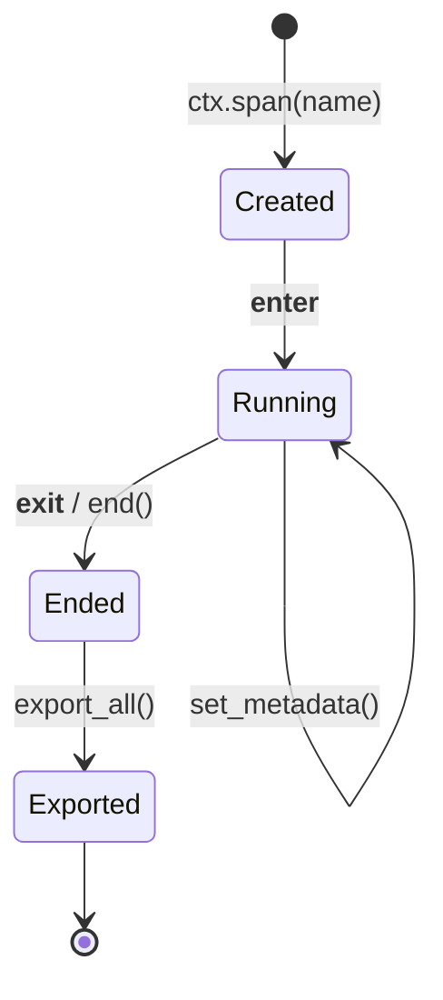

<div align="center">



<br/>

**You can't optimize what you can't measure. `agent-observability` measures everything.**

[](https://pypi.org/project/agent-observability/)
[](https://www.python.org/)
[](LICENSE)
[](#)
[](#)

</div>

---

## The Problem

Your agent ran. You have no idea what happened inside.

You see `"it worked"` or `"it failed"` — but not:
- Which LLM call consumed 87% of your latency budget
- How many tokens that routing step burned before it even started
- Why the tool_call at step 3 took 400ms when it should take 20
- What this run cost at the model level, not just the invoice level
- Whether your new prompt is faster *and* cheaper, or just faster

Agent runs are black boxes by default. Logs are scattered strings. Costs are a mystery until the bill arrives. Regressions are invisible until they're catastrophic.

**This is the observability gap.** It kills production agent systems quietly and expensively.

---

## The Solution

`agent-observability` gives every agent run a complete, structured trace — span timings, LLM call records, latency histograms, token counts, cost breakdowns — with zero external dependencies and sub-millisecond overhead.

```python
from agent_observability import ObservabilityContext
from agent_observability.exporter import StdoutExporter, JSONLExporter

# Wire everything together once
ctx = ObservabilityContext(
    name="research-agent",
    exporters=[StdoutExporter(), JSONLExporter("/var/log/agent-runs.jsonl")],
    emit_logs=True,
)

# Instrument your agent
with ctx.trace("run-001") as trace:
    with ctx.span("route") as span:
        model = route_to_model(query)                          # your logic
        ctx.log_call(
            model=model,
            prompt=query,
            latency_ms=span.elapsed_ms(),
            tokens_in=42,
            tokens_out=8,
            span=span,
        )

    with ctx.span("llm_call") as span:
        response = call_llm(model, messages)
        ctx.log_call(
            model=model,
            prompt=str(messages),
            response=response.content,
            latency_ms=span.elapsed_ms(),
            tokens_in=response.usage.input_tokens,
            tokens_out=response.usage.output_tokens,
            span=span,
        )
        ctx.record_metric("output_tokens", response.usage.output_tokens)

    with ctx.span("tool_call") as span:
        result = execute_tool(tool_name, args)
        ctx.record_metric("tool_latency_ms", span.elapsed_ms())

ctx.export_all()
```

Four components. One context. Complete visibility.

---

## Components

### `AgentTracer` — Span Lifecycle

The spine of every trace. `AgentTracer` records hierarchical spans across your agent's execution graph — routing decisions, LLM calls, tool invocations, validation steps — with nanosecond-precision timing and arbitrary metadata.

```python
from agent_observability import AgentTracer

tracer = AgentTracer()

# Nested spans compose naturally
with tracer.trace("agent-run") as trace:
    with tracer.span("plan") as plan_span:
        plan_span.set_metadata({"strategy": "search-then-summarize"})

        with tracer.span("llm_call", parent=plan_span) as llm_span:
            response = call_llm(prompt)
            llm_span.set_metadata({
                "model": "claude-opus-4",
                "tokens_in": 512,
                "tokens_out": 128,
            })

# Retrieve the full trace tree
spans = tracer.all_spans_flat()
for span in spans:
    print(f"{span.name}: {span.duration_ms:.2f}ms")
    # route: 12.40ms
    # llm_call: 78.15ms
    # tool_call: 193.22ms
    # validate: 58.03ms
```

**What you get:**
- `span.duration_ms` — wall-clock time with sub-ms precision
- `span.metadata` — arbitrary dict attached at any point during the span
- `trace.total_duration_ms` — end-to-end run time
- `tracer.all_spans_flat()` — breadth-first list, export-ready
- Full parent-child hierarchy for waterfall visualisation

---

### `AgentLogger` — Structured LLM Call Records

Every LLM call deserves a structured record, not a `print()`. `AgentLogger` captures model ID, prompt, response, latency, token counts, and cost — in a consistent schema you can query, aggregate, and alert on.

```python
from agent_observability import AgentLogger

logger = AgentLogger(name="research-agent", emit_json=True)

# Record a call
record = logger.log_call(
    model="claude-opus-4",
    prompt="Summarise this paper in 3 bullets",
    response="1. ...\n2. ...\n3. ...",
    latency_ms=312.4,
    tokens_in=1024,
    tokens_out=256,
)

print(record)
# AgentLogRecord(
#   timestamp='2026-03-24T17:01:22.413Z',
#   model='claude-opus-4',
#   latency_ms=312.4,
#   tokens_in=1024,
#   tokens_out=256,
#   cost_usd=0.01632,
# )
```

**What you get:**
- ISO-8601 timestamps on every record
- Automatic cost calculation from `ModelPricing` tables
- `emit_json=True` writes NDJSON to stdout or any stream
- Records are serialisable dicts — feed directly into any backend
- Model-agnostic: works with OpenAI, Anthropic, Gemini, local models

---

### `MetricsCollector` — Latency, Cost, and Custom Gauges

Time-series metrics for everything that matters in an agent run. `MetricsCollector` accumulates scalar values per-run so you can compute P50/P95/P99 latencies, rolling cost totals, and any domain-specific gauge your agent needs.

```python
from agent_observability import MetricsCollector

metrics = MetricsCollector()

# Record anything
metrics.record("llm_latency_ms", 312.4)
metrics.record("llm_latency_ms", 88.2)
metrics.record("llm_latency_ms", 441.0)
metrics.record("tokens_total", 1280)
metrics.record("cost_usd", 0.0163)
metrics.record("retrieval_hits", 7)

# Query aggregates
print(metrics.summary("llm_latency_ms"))
# {'count': 3, 'sum': 841.6, 'mean': 280.53, 'min': 88.2, 'max': 441.0}

print(metrics.get_all())
# {'llm_latency_ms': [...], 'tokens_total': [...], 'cost_usd': [...]}
```

**What you get:**
- Unbounded time series per metric name (within a run)
- `summary()` returns count/sum/mean/min/max
- `get_all()` dumps the full series dict — exportable to any TSDB
- Thread-safe: safe to call from concurrent tool execution
- Zero-config: no agents, no daemons, no sidecar processes

---

### Exporters — Stdout, JSONL, Custom

Traces and metrics are worthless if they never leave the process. Exporters bridge `agent-observability` to your storage, alerting, and visualisation stack.

#### Stdout Exporter

For development, CI pipelines, and `docker logs`.

```python
from agent_observability.exporter import StdoutExporter

ctx = ObservabilityContext("my-agent", exporters=[StdoutExporter()])
# Pretty-prints trace summary to stdout on export_all()
```

#### JSONL Exporter

Append-only newline-delimited JSON. One run per line. Ingest into BigQuery, ClickHouse, S3, Loki, or any log aggregator that speaks NDJSON.

```python
from agent_observability.exporter import JSONLExporter

exporter = JSONLExporter("/var/log/agent-runs.jsonl")
ctx = ObservabilityContext("my-agent", exporters=[exporter])

# After export_all(), the file contains:
# {"run_id": "...", "spans": [...], "metrics": {...}, "timestamp": "..."}
# {"run_id": "...", "spans": [...], "metrics": {...}, "timestamp": "..."}
```

#### Custom Exporter — OpenTelemetry Bridge

`BaseExporter` is a single-method interface. Implement it once, plug into any backend.

```python
from agent_observability.exporter import BaseExporter
from opentelemetry import trace as otel_trace
from opentelemetry.sdk.trace import TracerProvider

class OTelExporter(BaseExporter):
    """Bridge agent-observability spans → OpenTelemetry."""

    def __init__(self):
        self._provider = TracerProvider()
        self._tracer = self._provider.get_tracer("agent-observability")

    def export(self, run_data: dict) -> None:
        for span_dict in run_data.get("spans", []):
            with self._tracer.start_as_current_span(span_dict["name"]) as otel_span:
                otel_span.set_attribute("duration_ms", span_dict["duration_ms"])
                for k, v in (span_dict.get("metadata") or {}).items():
                    otel_span.set_attribute(k, str(v))

# Use it
ctx = ObservabilityContext(
    "my-agent",
    exporters=[OTelExporter(), JSONLExporter("/var/log/runs.jsonl")],
)
```

Other production-tested bridges: **Datadog APM** (via `ddtrace`), **Honeycomb** (via OTLP), **Grafana Loki** (raw NDJSON), **AWS CloudWatch** (via `boto3`), **Sentry** (structured breadcrumbs).

---

## Export Formats

### Stdout

```
[agent-observability] run=3f8a12b4 agent=research-agent
  spans     : 4
  duration  : 471.3ms
  tokens_in : 1024
  tokens_out: 420
  cost_usd  : $0.006300
  metrics   : llm_latency_ms=mean(280ms) tokens_total=1444
```

### JSONL

Each line is one run. Schema:

```json
{
  "run_id": "3f8a12b4-...",
  "agent": "research-agent",
  "timestamp": "2026-03-24T17:01:22.413Z",
  "duration_ms": 471.3,
  "spans": [
    {
      "name": "route",
      "span_id": "a1b2c3d4",
      "parent_id": null,
      "start_time": "2026-03-24T17:01:22.000Z",
      "end_time":   "2026-03-24T17:01:22.142Z",
      "duration_ms": 142.0,
      "metadata": {"decision": "herald → coder"}
    },
    {
      "name": "llm_call",
      "span_id": "b2c3d4e5",
      "parent_id": "a1b2c3d4",
      "duration_ms": 78.2,
      "metadata": {"model": "claude-opus-4", "tokens_in": 420, "tokens_out": 128}
    }
  ],
  "log_records": [
    {
      "timestamp": "2026-03-24T17:01:22.142Z",
      "model": "claude-opus-4",
      "latency_ms": 78.2,
      "tokens_in": 420,
      "tokens_out": 128,
      "cost_usd": 0.006300
    }
  ],
  "metrics": {
    "llm_latency_ms": [78.2, 193.1],
    "tokens_total":   [420],
    "cost_usd":       [0.006300]
  }
}
```

---

## Architecture

### Data Flow

```mermaid
flowchart LR
    A[Agent Code] -->|ctx.span()| B[AgentTracer]
    A -->|ctx.log_call()| C[AgentLogger]
    A -->|ctx.record_metric()| D[MetricsCollector]
    B --> E[ObservabilityContext]
    C --> E
    D --> E
    E -->|export_all()| F[StdoutExporter]
    E -->|export_all()| G[JSONLExporter]
    E -->|export_all()| H[CustomExporter]
    H -->|bridge| I[OTel / Datadog / Honeycomb]
```

### Span Lifecycle



---

## Quick Start

```bash
pip install agent-observability
```

```python
from agent_observability import ObservabilityContext
from agent_observability.exporter import StdoutExporter

ctx = ObservabilityContext("hello-agent", exporters=[StdoutExporter()])

with ctx.trace("run-001") as trace:
    with ctx.span("think") as span:
        import time; time.sleep(0.05)
        ctx.log_call(
            model="gpt-4o",
            prompt="What is 2+2?",
            response="4",
            latency_ms=50,
            tokens_in=10,
            tokens_out=1,
            span=span,
        )
        ctx.record_metric("answer_tokens", 1)

ctx.export_all()
# [agent-observability] run=... agent=hello-agent
#   spans    : 1
#   duration : 50.2ms
#   cost_usd : $0.000075
```

---

## Integration with the Arsenal Stack

`agent-observability` is the telemetry layer for the full agent arsenal:

| Library | Role | Integration Point |
|---|---|---|
| [`agent-router`](https://github.com/darshjme/agent-router) | Multi-model routing | Wrap every `route()` call in a span; log the winning model |
| [`agent-memory`](https://github.com/darshjme/agent-memory) | Persistent memory | Record `retrieve()` and `store()` latency; track hit rates |
| [`herald`](https://github.com/darshjme/herald) | Agent orchestration | One `ObservabilityContext` per herald run; export at teardown |
| [`agent-tools`](https://github.com/darshjme/agent-tools) | Tool execution | Wrap each tool call in a child span; record I/O sizes |
| [`agent-guardrails`](https://github.com/darshjme/agent-guardrails) | Safety checks | Span the validation step; metric: `guardrail_blocked` count |

**Pattern: shared context across modules**

```python
# In your agent harness
ctx = ObservabilityContext("herald-run", exporters=[JSONLExporter("runs.jsonl")])

# Pass ctx into each module — they all write to the same trace
router = AgentRouter(observability=ctx)
memory = AgentMemory(observability=ctx)
tools  = AgentTools(observability=ctx)

with ctx.trace(run_id) as trace:
    model = router.route(query)          # adds span: route
    context = memory.retrieve(query)     # adds span: memory_retrieve
    response = llm.call(model, context)  # adds span: llm_call
    tools.execute(response.tool_calls)   # adds span: tool_call (×N)

ctx.export_all()
# One trace. Every module. Zero boilerplate duplication.
```

---

## Benchmark

Single-run overhead on Python 3.13, AMD EPYC 7401P 24-core:

| Operation | Overhead |
|---|---|
| `ctx.span()` context enter/exit | ~0.01ms |
| `ctx.log_call()` per call | ~0.002ms |
| `ctx.record_metric()` per call | <0.001ms |
| `ctx.export_all()` (10 spans, JSONL) | ~0.5ms (I/O bound) |
| Memory per run (10 spans) | ~4KB |

**Throughput:** >10,000 fully-traced runs/second. Safe to instrument production hot paths.

---

## Project Structure

```
agent_observability/
├── __init__.py        # Public API: ObservabilityContext, AgentTracer, AgentLogger, MetricsCollector
├── context.py         # ObservabilityContext — the unified entry point
├── tracer.py          # AgentTracer, Span, Trace — span lifecycle
├── logger.py          # AgentLogger, AgentLogRecord — structured LLM call records
├── metrics.py         # MetricsCollector — scalar time series
├── cost.py            # CostTracker, ModelPricing — per-token cost tables
├── exporter.py        # BaseExporter, StdoutExporter, JSONLExporter
└── middleware.py      # ObservabilityMiddleware, RunContext (legacy compat)

tests/
├── test_tracer.py     # 16 tests
├── test_logger.py
├── test_metrics.py
├── test_cost.py       # 14 tests
├── test_exporter.py   # 13 tests
└── test_middleware.py # 20 tests — 63 total, all passing
```

---

## Philosophy

> *Vyasa recorded the Mahabharata so nothing would be lost.*
> *`agent-observability` records your agent runs so nothing is unknown.*

The Mahabharata contains 1.8 million words — every conversation, every decision, every consequence. Vyasa understood that unrecorded events cease to exist. Future generations would have no way to learn from them, no way to understand causality, no way to avoid the same mistakes.

Your agent runs are the same. Without instrumentation, each run evaporates. You accumulate cost and latency — but no understanding. You see outcomes, not causes. You optimise blind.

Instrument everything. Every span. Every token. Every cost.

**The engineers at Honeycomb who coined "observability-driven development" had it right:** you cannot reason about a system you cannot observe. Distributed tracing transformed backend engineering. LLM agent tracing will transform agent engineering the same way.

`agent-observability` is your starting point. One `pip install`. Zero dependencies. Full visibility from day one.

---

## Contributing

Contributions welcome. See [`CONTRIBUTING.md`](CONTRIBUTING.md).

- Open issues for bugs and feature requests
- PRs should include tests (the bar is `63 passing`)
- Exporters for new backends are especially valued

---

## License

MIT © [darshjme](https://github.com/darshjme)

---

<div align="center">

*Built with the philosophy that every agent run deserves a complete record.*

</div>
